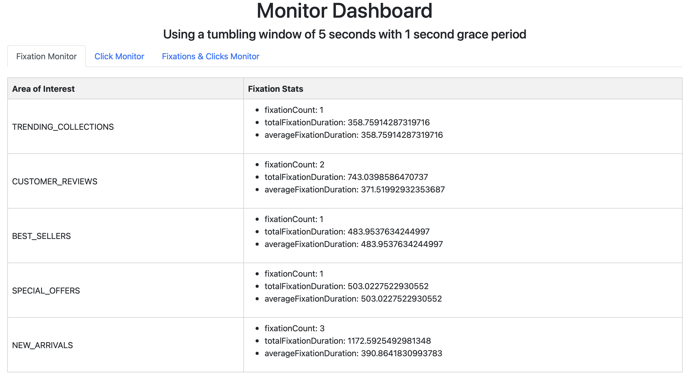

# lab14Part2-kafka-streams-eyeTracking3

This lab simulates the generation and processing of fixation and click stream data.
The topology covers both stateless and stateful processing **including time windowing**.
The project consists of three main modules: a **fixation producer**, a **click producer**, and an **event processing & monitoring**.

The lab is based on https://github.com/scs-edpo/lab14Part1-kafka-streams-patientmonitoring and https://github.com/scs-edpo/lab13Part2-kafka-streams-eyeTracking2.

Only the new concepts are introduced.

## Running the Project

1. Open a terminal/command prompt and navigate to the project's root directory.
2. Run `docker-compose up` to start the Kafka broker, Zookeeper, and the schema registry.
3. Run the [EventProcessingApp](StreamProcessing/src/main/java/magicalpipelines/EventProcessingApp.java)  to process fixation and click stream data and apply various stateless and stateful event processors. _Use VM option: -DstateDir=/tmp/kafka-streams-ET (See [How to add VM options IntelliJ IDEA?](#VM) in the appendix.)_
4. run the [FixationProducer](FixationProducer/src/main/java/FixationProducer.java) to start generating fixation data.
5. run the [ClicksProducer](ClicksProducer/src/main/java/ClicksProducer.java) to start generating click stream data.
6. Browser http://localhost:7070 to track several event monitors

## Producing Fixations

The [FixationProducer](FixationProducer/src/main/java/FixationProducer.java) class is meant for generating random fixation events and sending them to a Kafka topic. The main steps in this class are:

1. Initialize Kafka producer with properties from the `producer.properties` file.
2. Generate random fixation events using the `generateRandomFixation()` method.
3. Send generated fixation events to the "fixations" Kafka topic.

## Producing Clicks

The [ClicksProducer](ClicksProducer/src/main/java/ClicksProducer.java) class is meant for generating random click stream events and sending them to a Kafka topic. The main steps in this class are:

1. Initialize Kafka producer with properties from the `producer.properties` file.
2. Generate random click events using the `generateRandomClick()` method.
3. Send generated click events to the "clicks" Kafka topic.


## Events processing

[EventProcessingApp](StreamProcessing/src/main/java/magicalpipelines/EventProcessingApp.java) uses the [EyeTrackingTopology](StreamProcessing/src/main/java/magicalpipelines/topology/EyeTrackingTopology.java) class which  is meant for processing raw fixation and click data through a series of stateless and stateful processors.

### Topology

1. **Define Serdes**: Define Serdes for Fixation, FixationStats, Click, and FixationClick classes, named `fixationSerde`, `fixationStatsSerde`, `clickSerde`, and `fixationClickSerde` respectively. These Serdes are used to convert data between different formats.

2. **Stream Fixation events**: Create a KStream named `fixationStream` to consume fixation events from a Kafka topic named "fixations" using the `fixationConsumerOptions` which specifies the Serdes and timestamp extractor.

3. **Stateless processing for fixations**: Perform several operations on the `fixationStream`:
   - Content filtering: Create a new KStream named `contentFilteredFixations` that keeps only relevant attributes.
   - Event filtering: Create a new KStream named `eventFilteredFixations` that keeps only fixations with duration above or equal to 60 ms.
   - Event translation: Create a new KStream named `eventTranslatedFixations` that finds the AOI based on the X and Y positions of the fixation.

4. **Stateful processing for fixations**: Define a KTable named `fixationStats` that stores the aggregated fixation statistics by AOI and window.
   - Window the fixation events using a tumbling window of 5 seconds with 1 second grace period.
   - Group the fixations by AOI and aggregate them to compute fixation count, average fixation duration, and total fixation duration per AOI.

5. **Stream Click events**: Create a KStream named `clickStream` to consume click events from a Kafka topic named "clicks" using the `clickConsumerOptions` which specifies the Serdes and timestamp extractor.

6. **Stateful processing for click events**: Define a KTable named `clickCounts` that stores the aggregated click count by AOI and window.
   - Window the click events using a tumbling window of 5 seconds with 1 second grace period.
   - Group the clicks by AOI and aggregate them to compute the click count per AOI.

7. **Joining fixations and clicks**:
   - Convert the KTables `fixationStats` and `clickCounts` to KStreams named `fixationStatsStream` and `clickCountsStream`, respectively.
   - Join these KStreams based on their AOI using a window join with a window of 5 seconds and a 1 second grace period. The resulting KStream is named `fixationClickJoined`.

8. **Create a KTable for FixationClick**: Define a KTable named `fixationClickTable` that stores the latest FixationClick object per AOI.


## Monitoring Fixation and Click Events

In the [EyeTrackingTopology](StreamProcessing/src/main/java/magicalpipelines/topology/EyeTrackingTopology.java) class, the KTables referring to the different aggregations/joining of fixation and click events (cf. Topology Steps 4,6,8) are materialized into 3 local stores named "fixationStats", "clickCount", and "FixationClickStats".

The [MonitorService](StreamProcessing/src/main/java/magicalpipelines/MonitorService.java) class is responsible for monitoring the fixation and click events using a Javalin web server. The methods `getFixationStats`, `getClickCount`, and `getFixationClickCount` are defined to query and retrieve data from the "fixationStats", "clickCount", and "FixationClickStats" local stores respectively.

The retrieved data is accessible through the Javalin web server with the following routes:

- `/fixationMonitor`: Returns the fixation statistics (fixation count, total fixation duration and average fixation duration per AOI) by calling the `getFixationStats` method.
  
```bash
curl http://localhost:7070/fixationMonitor
```

- `/clickMonitor`: Returns the click count per AOI by calling the `getClickCount` method.
```bash
curl http://localhost:7070/clickMonitor
```
- `/fixationClickMonitor`: Returns the joined fixation and click stats data by calling the `getFixationClickCount` method.
```bash
curl http://localhost:7070/fixationClickMonitor
```

The web-server offers also an interactive/self-refreshing GUI at http://localhost:7070. 




## Exercise

1. Explore the different classes of the project and examine the provided implementation. 
2. Try to extend the provided implementation such that the event monitor shows similar statistics on the pupil size measure (min, max, average per AOI in a defined time window).


<a name="VM"></a>
## Appendix: How to add VM options IntelliJ IDEA? 


